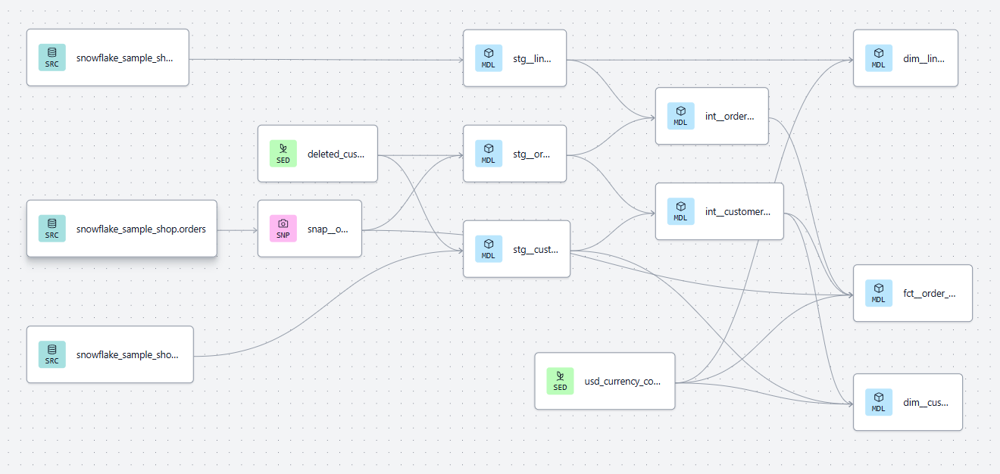
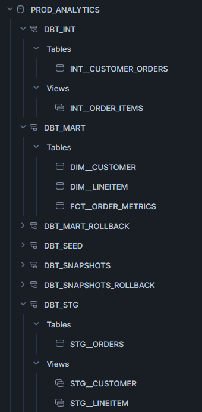

# dbt Sample Project

This project transforms Snowflake sample data in a star schema (Fact + Dimensions) that is optimized for reporting and analysis.
Sample data includes customers, their orders, and order line items.

The project uses a layered model structure, along with snapshots, seeds, and macros.

Layers include:
- Staging (**stg**): Cleanse, filter data, and rename columns
- Intermediate (**int**): Join and aggregate stg models
- Mart (**mart**): Join data and define a star schema using a fact and dimensions for optimized reporting

[GitHub Project Link](https://github.com/dbt-snowflake-demo/sample-project)

